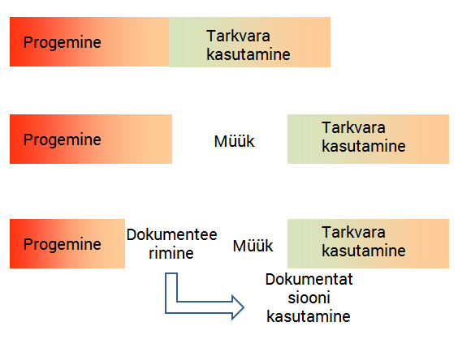
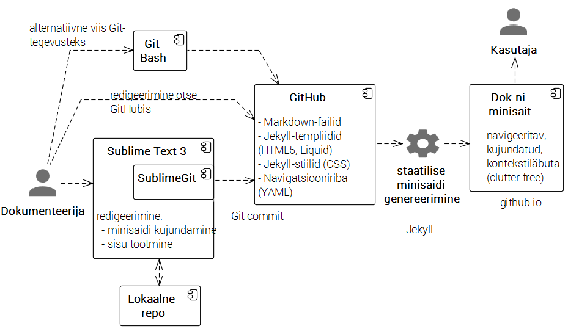

# Hea dokumentatsiooni tellimise saladus

## 0  Avamõte
  - Programmeerijatele ei meeldi dokumenteerida
  - *Why Programmers Hate Documenting? -- Joel on Software

## 1  Mudelid

- Progemine -> Tarkvara kasutamine
  - *Build and They Will Come
  - Programmeerimine -> Müük -> Kasutamine
  - Programmeerimine -> Dokumenteerimine -> Müümine
  - alamvoog:
    - Dokumenteerimine -> Dokumentatsiooni kasutamine

## 2  Dokumentatsiooni juures oluline; palju asju, mõned:
 - olemasolu
 - ülesleitavus
 - navigeeritavus
 - seletab asju ka _sisuliselt_
   - Märkus. Inimesi, kellel on võime/tahe IT-s asju lahti seletada, on väga vähe.
 - _Lasting value_  
  - [Six-page memo (Jeff Bezos/Amazon)](http://blog.idonethis.com/jeff-bezos-self-discipline-writing/)
 - *The Missing Manual -- O'Reilly
   - Mis on toote YYY dokumentatsioonis puudu? Juhend, mis _seletab lahti_ XXX olemuse

## 3  Ambitsioonitasemed

Kui peame dokumentatsiooni oluliseks, soovime head dokumentatsiooni.
  - tase 0: mingi dokumentatsioon, suvalises vormingus (PDF)
  - ...
  - navigeeritav, kontekstiläbuta, professionaalse kujundusega dokumentatsioonisait

## 4  Dokumentatsiooni tootmise töövoog: nõuded
  - kaks vaatepunkti:
    - dokumentatsiooni tootja
    - dokumentatsiooni kasutaja
  - mõlemal peab olema hea
  - tootja valib _ise_ tööriista
  - kasutajale aga esitatakse kasutaja soovitud kujul
  - need kaks ei tarvitse ühte lamgeda
  - järelikult on vaja teisendusi, andmete viimist ühest vormingust teise
  - teisendusi ei saa vältida, see on IT olemus
  - samal ajal, vahelülid on saatanast

## 5  Dokumentatsiooni minisait: millega teha?
  - Jekyll, Hugo, Middleman, MkDoc ...
  - häid vahendeid on raske leida

## 6  Üks võimalik töövoog
  - Markdown
  - GitHub
  - Git Bash
  - Jekyll
  - HTML5
  - CSS3
  - Liquid
  - YAML
  - Sublime Text 3
  - asciiFlow
  
  Järeldus. Kahjuks ei saa me läbi ühe töövahendiga. Töövahendite lõimimine on päris suur väljakutse.

  

## 7  Viie projekti võrdlus

'Mis karakteristikud viivad hea dokumentatsioonini?

  - projekt 1: dokumentatsiooni kvaliteet üldiselt hea, nõudis tellija suurt tähelepanu 
  - projekt 2: eraldi kvaliteedikontroll, võimekad ja hoolsad inimesed, dokumentatsiooni kvaliteet ületab ootusi
  - projekt 3: rollide ühitamine, eraldi dokumenteerija ja kvaliteedikontroll puudus; dokumentatsiooni kvaliteet mitterahuldav
  - projekt 4: agiilne projekt, eraldi dokumenteerimine eraldi inimese poolt
  - projekt 5: Eraldi inimene dokumentatsiooni peal, dokumentatsiooni kvaliteet väga hea

## 8  Hea dokumentatsiooni tellimise saladus
  Empiiriline andmestik viib järgmise üldistuseni. Hea dokumentatsiooni tekib siis, kui:
  
  - dokumentatsioonile on eraldi inimene
  - täitjal jääb aega dokumentatsiooni tegemiseks

